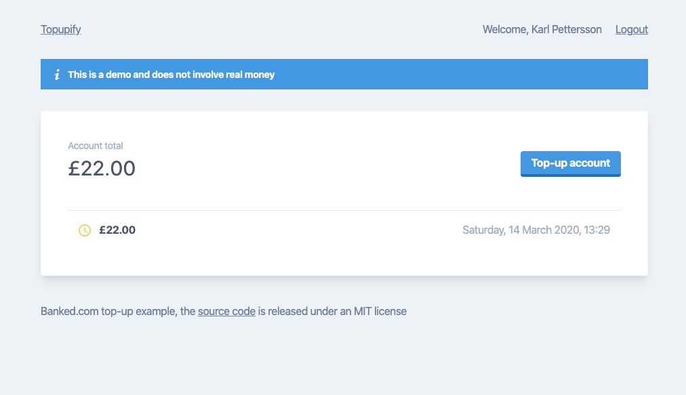

# 🛍 Example Top-up

[](https://heroku.com/deploy?template=https://github.com/banked/example-topup)

> An [Express.js](https://expressjs.com/) top-up example demonstrating the Banked API that is currently [deployed to Heroku](https://banked-example-topup.herokuapp.com/)



This dummy top-up example allows users to create an account and 'top it up' with arbitrary amounts of funds. It also contains a secret (🤫) admin UI that can be used to make batch payments.

If you want to see the Banked specific parts checkout `./db/topups.js` for creating the checkout URL on the backend that the stores redirects people too and `./routes/webhook.js` for an example of how to verify Banked's webhooks.

Users and top-ups are stored in memory and ephemeral, so if the app restarts all of the users and their top-ups are wiped (this is deliberate). When a user logs out of their account, it is deleted and their top-ups wiped as well.

## Build Setup

``` bash
# install dependencies
$ npm install

# Launch server
$ npm run start
```

This example implements the receiving and verification of [Banked's Webhooks](https://console.banked.com/test/webhooks). Which you'll need to setup before deploying the store or for topups to ever leave a `pending` state.

This example also implements a `/clear?token=*` route that enables you to purge all users and top-ups. The token in the query string is matched against the `CLEAR_TOKEN` environment variable.

## Deploying the popup example

The store is automatically deployed to [Heroku](https://banked-example-store.herokuapp.com/) when a commit is pushed to the master branch.

### Environment variables

There are several environment variables that need to be set on the server to be able to make payments. You can add them to the checked in `./.env` file and they'll be automatically pulled and used by the backend.

* `BANKED_API_KEY` is your API key from [Banked's Console](https://console.banked.com)
* `BANKED_API_SECRET` is the secret key from [Banked's Console](https://console.banked.com)
* `BASE_URL` is the base url of where this site is deployed (e.g. `https://example.com`) and is used for constructing the callback URL's Banked's checkout will redirect to on success or error of the payment
* `PAYEE_NAME` the name of the bank account payments will be made into
* `ACCOUNT_NUMBER` is the bank account number the payments will be made into
* `SORT_CODE` is the sort-code of the account the payments will be made into
* `SIGNATURE_KEY` is the signature key setup when configuring your webhooks in [Banked's Console](https://console.banked.com)
* `CLEAR_TOKEN` the token the app will use to verify permissions to clear it's storage


